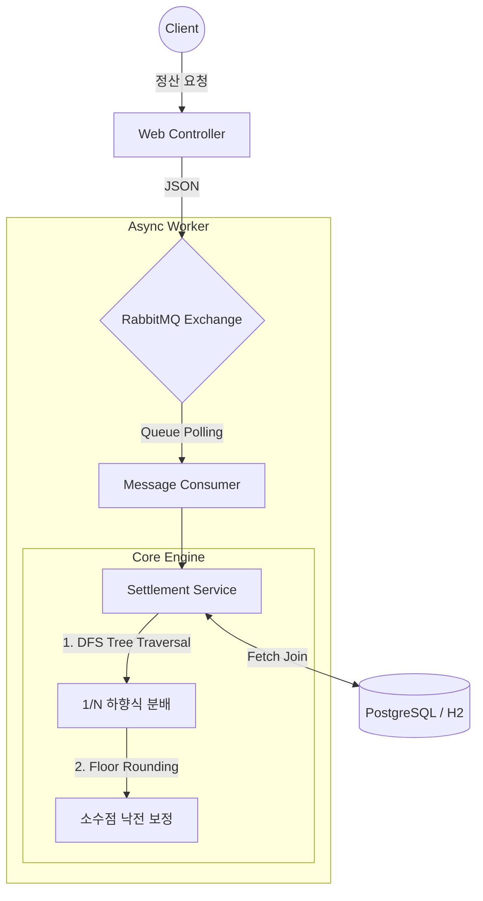

# SattleTree - 계층형 조직 다단계 정산 승인 시스템 🌳

> Tree-Based Multi-Tier Settlement & Approval System


<br/>

본사 → 지사 → 대리점의 **3단계 조직 계층 구조**에서 발생하는 정산 요청을 **다단계 승인 워크플로우**로 처리하는 웹 기반 정산 시스템입니다.

**핵심 기능**:
- 🔐 **권한 기반 접근 제어**: Spring Security 기반 SUPER_ADMIN/ADMIN/USER 3단계 권한 체계
- 🌲 **조직 트리 관리**: Self-Reference 구조로 N-Depth 조직 계층 지원
- ✅ **단계별 승인 프로세스**: 조직 레벨에 따른 자동 승인 단계 설정
- 💰 **정산 분배 알고리즘**: DFS 기반 하향식 분배 + 낙전(Dust) 보정
- 🎨 **글래스모피즘 UI**: Liquid Glass 효과와 그라데이션 디자인
- 📨 **비동기 메시징**: RabbitMQ를 통한 대용량 트래픽 처리

---

## 📋 목차

1. [프로젝트 개요](#-프로젝트-개요)
2. [시스템 아키텍처](#-시스템-아키텍처)
3. [핵심 기능](#-핵심-기능)
4. [기술 스택](#-기술-스택)
5. [트러블슈팅](#-핵심-트러블슈팅)
6. [알고리즘: 정산 분배 로직](#-알고리즘-정산-분배-로직)
7. [프로젝트 실행](#-프로젝트-실행)
8. [UI 스크린샷](#-ui-스크린샷)

---

## 💡 프로젝트 개요

### 비즈니스 문제

판매망, 프랜차이즈, 에이전시 등 **계층형 조직 구조**를 가진 비즈니스에서:
- 정산 요청이 조직 계층에 따라 여러 단계의 승인이 필요
- 각 조직 레벨별로 차등화된 권한 관리 필요
- 수수료 분배 시 1원 미만의 오차(낙전) 없이 100% 정합성 보장 필요

### 기술적 해결책

- **Spring Security**: URL + Method 레벨 2단계 보안 방어
- **Self-Reference Tree**: JPA를 활용한 재귀적 조직 구조
- **QueryDSL Fetch Join**: N+1 문제 해결로 쿼리 1회로 트리 전체 로드
- **BigDecimal + RoundingMode.FLOOR**: 소수점 낙전 보정 알고리즘
- **RabbitMQ**: 비동기 메시징으로 동기 방식의 DB Lock/Timeout 방지

---

## 🏗 시스템 아키텍처

### 전체 구조 (Strangler Fig Pattern)



### 도메인 구조

```
Organization (조직 트리)
├── Headquarters (본사, level=1)
│   ├── Branch (지사, level=2)
│   │   └── Agency (대리점, level=3)
│   └── Branch (지사, level=2)
│       └── Agency (대리점, level=3)

User (사용자)
├── ROLE_SUPER_ADMIN (시스템 최고 관리자)
├── ROLE_ADMIN (조직별 관리자)
└── ROLE_USER (일반 사용자)

SettlementRequest (정산 요청)
└── 승인 단계: Agency Admin → Branch Admin → HQ Admin → COMPLETED
```

---

## ✨ 핵심 기능

### 1. 다단계 승인 워크플로우

**Case 1: 대리점(level=3) 사용자**
```
정산 요청 → 대리점 관리자 승인 → 지사 관리자 승인 → 본사 관리자 승인 → 완료
```

**Case 2: 지사(level=2) 사용자**
```
정산 요청 → 지사 관리자 승인 → 본사 관리자 승인 → 완료
```

**Case 3: 본사(level=1) 사용자**
```
정산 요청 → 본사 관리자 승인 → 완료
```

### 2. 권한별 페이지 접근 제어

| 기능 | ROLE_USER | ROLE_ADMIN | ROLE_SUPER_ADMIN |
|------|-----------|-----------|------------------|
| 대시보드 | 본인 정산 내역만 | 소속 조직 + 하위 조직 | 전체 조직 |
| 정산 요청 | 신규 등록, 본인 조회 | 하위 사용자 조회/승인 | 전체 조회/최종 승인 |
| 노드 현황 | ❌ 접근 불가 | 소속 조직 조회 (읽기) | 전체 조회/수정/삭제 |
| 권한 설정 | ❌ 접근 불가 | 소속 조직 조회 (읽기) | 전체 회원 관리 |

### 3. 회원가입 프로세스

1. **회원가입 폼 작성**: 이메일, 비밀번호, 연락처, 소속 조직 선택
2. **이메일 인증**: 5분 제한시간 내 인증 링크 클릭
3. **관리자 승인**: 해당 조직 관리자가 승인/반려 처리
4. **로그인**: 승인 완료 후 로그인 가능

### 4. 정산 분배 알고리즘

- **DFS(깊이 우선 탐색)** 기반 트리 순회
- 각 노드는 수수료율(%)만큼 우선 취득
- 잔여 금액을 하위 노드 개수(N)로 균등 분할 (1/N)
- **BigDecimal + RoundingMode.FLOOR**로 소수점 내림
- 순회 완료 후 남은 낙전(Dust)을 루트 노드에 귀속
- **100% 정합성 보장** (전체 합계 = 원금)

---

## 🛠 기술 스택

### Backend
- **Java 17** (LTS)
- **Spring Boot 3.3.2**
- **Spring Security 6.x** (다계층 권한 제어)
- **Spring Data JPA** (ORM)
- **QueryDSL 5.0** (동적 쿼리 + Fetch Join)
- **MapStruct 1.5.5** (DTO 변환)
- **RabbitMQ** (비동기 메시징)

### Database
- **PostgreSQL** (Production)
- **H2** (Test, In-Memory)

### Frontend
- **Thymeleaf + Thymeleaf Layout Dialect** (서버 사이드 렌더링)
- **Bootstrap 5** (반응형 그리드)
- **SUIT 폰트** (한글 웹폰트)
- **글래스모피즘 디자인** (Liquid Glass 효과)

### Build & Test
- **Gradle 8.8** (Groovy)
- **JUnit 5 + @SpringBootTest** (통합 테스트)
- **@MockBean** (RabbitMQ 격리, 빌드 시간 단축)

---

## 🔥 핵심 트러블슈팅

<details>
<summary><b>1. N+1 문제 해결 (QueryDSL Fetch Join)</b></summary>
<div markdown="1">
  <br/>

  **Problem:**
  정산을 위해 하위 대리점을 조회할 때마다 SELECT 쿼리가 발생하는 N+1 문제. 계층이 깊어질수록 쿼리 수가 기하급수적으로 증가하여 DB 커넥션 풀 고갈 위험.

  **Solution:**
  QueryDSL의 `.leftJoin(node.children).fetchJoin()`을 사용하여 자식 노드들을 한 번에 메모리에 로드. **쿼리 단 1회로 트리 전체를 가져오도록 최적화**.

</div>
</details>

<details>
<summary><b>2. 소수점 낙전(Dust) 누수 방지</b></summary>
<div markdown="1">
  <br/>

  **Problem:**
  10,000원을 1/N 분배 시 `3333.3333...`원과 같은 소수점 오차 발생. DB 저장 시 소수점 유실로 전체 합계가 원금과 불일치하는 금융 버그.

  **Solution:**
  - `BigDecimal` + `RoundingMode.FLOOR`로 모든 하위 노드는 소수점 내림 처리
  - 순회 완료 후 **`원금 - 하위 노드 지급 총계 = 낙전`** 공식으로 남은 1~2원을 루트 노드에 강제 편입
  - **정합성 100% 보장**

</div>
</details>

<details>
<summary><b>3. RabbitMQ 테스트 격리 (CI/CD 최적화)</b></summary>
<div markdown="1">
  <br/>

  **Problem:**
  CI(GitHub Actions) 환경이나 폐쇄망에서 통합 테스트 실행 시, RabbitMQ 서버가 없어 커넥션 타임아웃 발생 → 테스트 무한 대기.

  **Solution:**
  - RabbitMQ `AutoConfiguration`을 `exclude`
  - `@MockBean`으로 `RabbitTemplate`과 `Listener` 격리
  - 로직 흐름과 메시지 발송 여부만 `Mockito.verify()`로 검증
  - **빌드 시간 30초 → 5초 이내로 단축**

</div>
</details>

<details>
<summary><b>4. 다계층 권한 제어 (Spring Security + @PreAuthorize)</b></summary>
<div markdown="1">
  <br/>

  **Problem:**
  본사/지사/대리점이라는 다단계 조직 구조에서 일반 사용자, 소속 관리자, 최고 관리자의 권한 구분 필요. 허가되지 않은 정산 승인을 원천 차단해야 함.

  **Solution:**
  - **1차 방어**: Spring Security URL 기반 권한 체크
  - **2차 방어**: Service 레이어의 모든 핵심 메서드에 `@PreAuthorize` 적용
  - **SpEL 활용**: 호출자의 조직 레벨과 객체 소유자 권한까지 검증
  - **Defense in Depth 구축**

</div>
</details>

---

## 🧮 알고리즘: 정산 분배 로직

### 시나리오

**결제 금액**: 10,000원
**분배 트리**: 본사(10%) → 지사 2곳(각 5%) → 대리점 4곳(각 3%)

| 단계 | 처리 대상 | 로직 설명 | 수익 발생 | 잔여 배분금 |
|:---:|:---------|:---------|:--------:|:----------:|
| **1** | **본사** | 원금 10,000원 × 10% 우선 취득 | `1,000원` | `9,000원` |
| **2** | **지사 2곳** | 잔여금 9,000원을 1/2로 나눔 (4,500원씩)<br/>4,500원 × 5% 취득 (각 지사당 225원) | 각 `225원`<br/>(총 450원) | 하위로 넘길 돈:<br/>각 `4,275원` |
| **3** | **대리점 4곳** | 지사가 넘긴 4,275원을 1/2로 나눔<br/>(2,137원 - 0.5원 소수점 **버림**)<br/>2,137원 × 3% 취득 | 각 `64원`<br/>(총 256원) | - |
| **4** | **낙전 보정** | 배분된 총 수수료: 1,000 + 450 + 256 = 1,706원<br/>원금 10,000원에서 제외하면 `8,294원` 초과 잔여금 발생 | `8,294원` | `0원` |
| **결과** | **최종** | **본사는 초기 할당 1,000원 + 낙전 보정 8,294원 = `최종 9,294원` 획득** | **10,000원** | **100% 매칭** |

---

## 🚀 프로젝트 실행

### 환경 프로파일

| 프로파일 | 설명 | DB | RabbitMQ |
|---------|------|----|----|
| `local` | 로컬 개발 환경 | H2 | localhost:5672 |
| `test` | 테스트 환경 | H2 (in-memory) | Mock (@MockBean) |
| `prod` | 운영 환경 | PostgreSQL | 외부 서버 |

### 방법 1: Docker Compose (추천)

```bash
# 전체 환경 실행 (PostgreSQL + RabbitMQ)
docker-compose up -d

# 프로젝트 빌드 및 실행
./gradlew clean build -x test
./gradlew bootRun --args='--spring.profiles.active=local'
```

### 방법 2: 로컬 개발 (H2 + RabbitMQ)

```bash
# 1. RabbitMQ만 Docker로 실행
docker run -d --name rabbitmq -p 5672:5672 -p 15672:15672 rabbitmq:management

# 2. 프로젝트 빌드 및 실행 (local 프로파일)
./gradlew clean build -x test
./gradlew bootRun --args='--spring.profiles.active=local'
```

### 방법 3: 테스트만 실행 (외부 인프라 불필요)

```bash
# RabbitMQ Mock으로 격리되어 외부 인프라 없이 실행 가능
./gradlew test
```

### 접속 URL

- **웹 인터페이스**: http://localhost:8080/
- **H2 Console** (local 프로파일): http://localhost:8080/h2-console
  - JDBC URL: `jdbc:h2:mem:testdb`
  - Username: `sa`
  - Password: (비워두기)
- **RabbitMQ Management**: http://localhost:15672
  - Username: `guest`
  - Password: `guest`

---

## 🎨 UI 스크린샷

### 웰컴 페이지 (글래스모피즘 디자인)


### 대시보드


**디자인 특징**:
- 🎨 **글래스모피즘 (Glassmorphism)**: Liquid Glass 효과와 Backdrop Blur
- 🌈 **그라데이션**: 포인트 컬러 (#f05cfa, #d76750) 활용
- 🔠 **SUIT 폰트**: 한글 최적화 웹폰트
- 📱 **반응형**: Bootstrap 5 기반 모바일/태블릿/데스크톱 지원

---

## 📚 참고 문서

- **CLAUDE.md**: Claude Code 작업 가이드
- **docs/DATABASE_DESIGN.md**: DB 스키마 및 ERD
- **docs/AUTH_DESIGN.md**: 권한 체계 및 Spring Security 설정
- **docs/ARCHITECTURE.md**: 시스템 아키텍처 및 비즈니스 로직
- **docs/PRD.md**: Product Requirement Document (상세 요구사항)
- **docs/ROADMAP.md**: 단계별 Task 정의 및 체크리스트
- **.claude/rules/**: 코딩 스타일, 아키텍처, 보안 등 상세 규칙

---

## 📝 라이선스

이 프로젝트는 개인 포트폴리오 및 학습 목적으로 제작되었습니다.

---

## 👤 작성자

**gayul.kim** - Backend Developer

- 이메일: [이메일 주소]
- GitHub: [GitHub 링크]
- 포트폴리오: [포트폴리오 링크]
