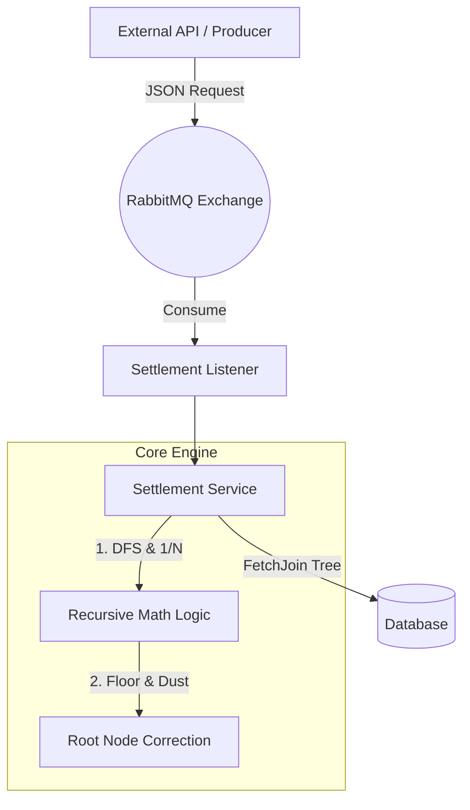

# Tree-Based Multi-Tier Settlement Engine

(트리 기반 다단계 수수료 정산 엔진)

## 프로젝트 개요 (Overview)

본 프로젝트는 판매망, 프랜차이즈, 다단계 조직 등 계층형(Tree) 구조를 가진 비즈니스 환경에서 발생하는 수익을 각 계층의 지정된 수수료율에 따라 자동으로 분배하는 **비동기 정산 엔진(Settlement Engine)**입니다.

단순한 1:1 정산이 아닌 다단계 깊이(Depth)를 가진 노드 간의 복잡한 정산 비율을 계산하며, 소수점 단위의 낙전(Dust) 처리와 대용량 트래픽 처리를 위한 메시지 큐 비동기 아키텍처를 도입하여 시스템의 안정성과 정확성을 극대화하는 것을 목표로 설계되었습니다.

## 개발 동기 및 목적 (Motivation)

- **복잡한 분배 알고리즘 구현**: 단순 배열 순회가 아닌 계층 구조(Tree)를 DFS 방식으로 순회하며 `1/N` 하향식 분배 알고리즘을 구현하는 아키텍처 설계 역량을 구체화하기 위함입니다.
- **금융 데이터의 정합성 확보**: 정산 과정에서 필연적으로 발생하는 소수점 이하 금액(낙전)을 유실 없이 추적하고 최상위 노드에 귀속시켜, Java `BigDecimal`을 활용한 금액 계산의 무결성을 보장하고자 했습니다.
- **안정적인 비동기 처리 구조**: 외부 결제 시스템과의 연동 시 타 시스템과의 강결합을 낮추고, 단일 스레드 병목으로 인한 지연을 최소화하기 위해 RabbitMQ를 도입하여 처리 성능 및 구조적 안정성을 도모했습니다.
- **방어적 프로그래밍과 자동화 테스트**: 장애나 네트워크 이슈 발생 시 데이터 유실을 방지하는 메시지 재시도(Retry) 메커니즘을 적용하였으며, 기능 단위부터 E2E 구간까지 Mock 객체를 활용한 격리형 테스트 코드를 작성해 시스템의 신뢰도를 확보했습니다.

## 핵심 기능 (Core Features)

### 1. 계층형 트리 기반 정산 로직 (DFS)

- 본사(Root)에서 시작하여 각 대리점(Leaf)으로 이어지는 무한 깊이(N-Depth)의 트리 구조를 처리합니다.
- 부모 계층에서 자신의 수수료(%)를 제한 차액을 자식 노드들의 수에 맞춰 `1/N` 동등하게 나눈 후, 재귀적으로 하위 정산을 수행합니다.

### 2. 낙전(Dust) 보정 시스템

- 한국 원화(KRW) 기준 1원 미만의 소수점 금액이 분산될 때 `RoundingMode.FLOOR`(소수점 내림) 정책을 사용합니다.
- 재귀 호출이 모두 끝난 뒤, 원금에서 계산된 전체 수수료 총합을 뺀 나머지(누락된 1원 단위 자투리 금액)를 모두 모아 최상위 루트 노드의 수익으로 강제 합산하여 정확한 100% 매칭을 유지합니다.

### 3. 메시지 큐 기반 대용량 비동기 정산 (RabbitMQ)

- 대량의 외부 결제/정산 요청을 즉시 DB에 반영하지 않고 RabbitMQ `Queue`에 적재하여 백그라운드에서 순차적으로 안전하게 소화합니다.
- 단순 컨슈밍 로직 에러 외에 DB 데드락이나 일시적 타임아웃이 발생할 경우를 대비하여 `Exponential Backoff` 설정된 Retry 정책을 통해 지정된 횟수만큼 재시도 후 실패 풀(Dead Letter)로 분리될 수 있는 기초 구조를 갖췄습니다.

## 기술 스택 (Tech Stack)

### Backend

- **Java 17** : Record 패턴, 향상된 Switch문 등 모던 자바 문법 활용
- **Spring Boot 3.3.2** : 애플리케이션 프레임워크 기반 구성
- **Spring Data JPA, Hibernate** : 객체 관계 매핑 및 데이터 영속성 관리
- **QueryDSL 5.0** : 컴파일 타임 안정성을 가진 동적 쿼리 및 트리 노드 페치 조인(Fetch Join) 최적화

### Infrastructure & Messaging

- **RabbitMQ (Spring AMQP)** : 대용량 비동기 메시징 처리
- **H2 / PostgreSQL** : 테스트(In-Memory) 및 런타임 영속성 처리
- **Docker** : 메시지 브로커 로컬 및 격리 환경 컨테이너 구성

### Frontend & Build

- **Thymeleaf** : 백오피스 Admin 대시보드 및 디버깅용 UI 렌더링
- **Gradle 8.0+** : 프로젝트 의존성 관리 및 빌드

## 소프트웨어 아키텍처 (Architecture)



## 비즈니스 로직 예시 (Calculation Logic Example)

**시나리오**: 단가가 10,000원인 상품. <br/>
트리 배치: **본사(10%) -> 지사A(5%), 지사B(5%) -> 대리점 4개점 (각 3%)**

1. **상위자 지분 취득**: 본사 수수료 계산 (10,000원 \* 10% = 1,000원)
2. **잔액 분배**: 남은 9,000원을 자식 노드인 지사 2곳으로 1/2 하여 4,500원씩 분배
3. **하위 지사 계산**: 대상자 각각 (4,500원 \* 5% = 225원 수수료 획득)
4. **리프 대리점 분배/계산**: 지사가 남긴 (4500-225)=4275원을 각각 하위 대리점으로 1/2 분배.
   - 단가 2,137원 지급 (소수점 절삭 발생) -> 대리점 수수료: 2,137 \* 3% = 64원.
5. **낙전 보정**: 전체 합산 수수료(1,706원)를 원금에서 제한 차액(8,294원)을 검출해 본사 최종 수익으로 합산.
6. **최종 본사 수익**: `9,294원` 처리.

## 로컬 환경 실행 가이드 (How to Run)

본 프로젝트는 의존성만 확보되면 로컬에서 즉시 구동 및 테스트할 수 있습니다.

### 1. RabbitMQ 로컬 구동 (Docker)

애플리케이션은 기본적으로 로컬호스트(localhost)의 5672 포트를 바라봅니다.

```bash
docker run -d --name rabbitmq -p 5672:5672 -p 15672:15672 rabbitmq:management
```

### 2. 프로젝트 빌드 및 실행

```bash
# 빌드 및 백그라운드 패키징
./gradlew clean build -x test

# 어플리케이션 부트
./gradlew bootRun
```

- 서버 진입 경로: `http://localhost:8080/`

### 3. 테스트 코드 검증

```bash
./gradlew test
```

- 본 프로젝트의 통합/E2E 테스트는 폐쇄망이나 브로커(RabbitMQ) 미설치 환경에서도 Build가 가능하도록 `@MockBean`을 활용하여 **독립 고립성**을 유지하고 있습니다. 외부 환경 의존성 없이 정상적으로 테스트 실행이 가능합니다.
