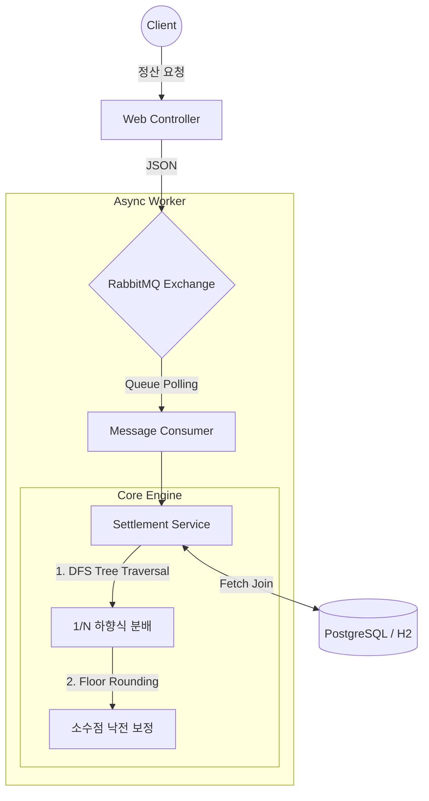
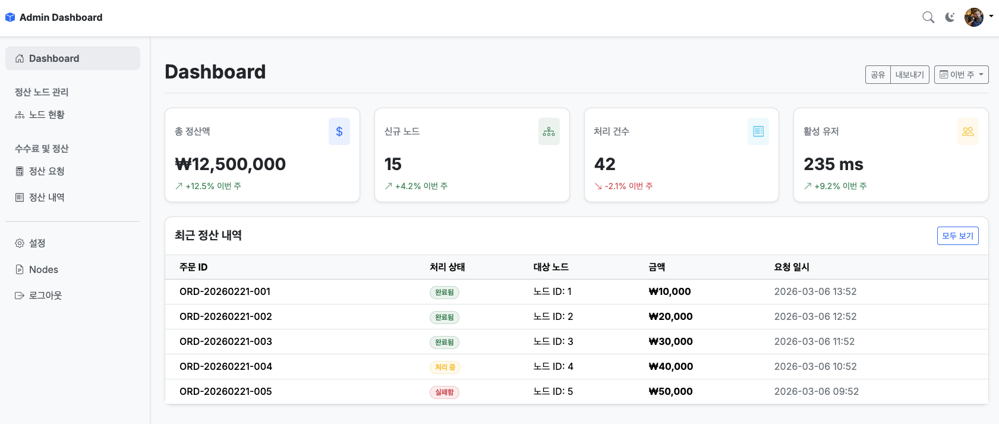
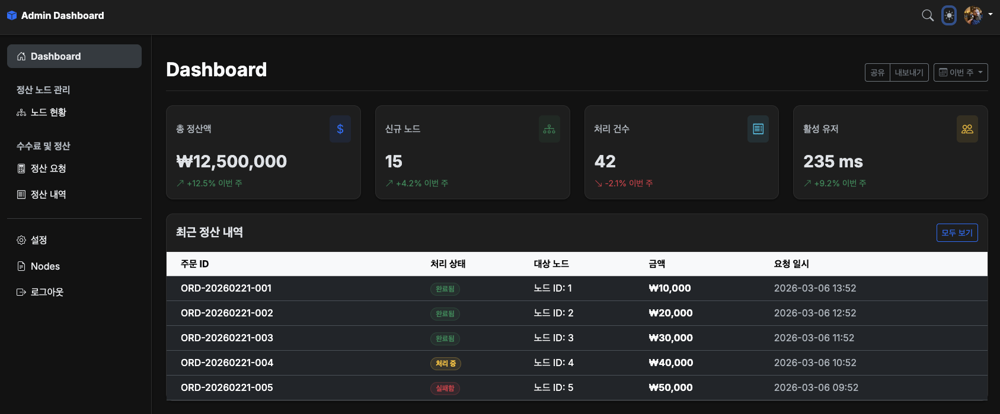

# Tree-Based Multi-Tier Settlement Engine

> 트리 기반 다단계 수수료 비동기 정산 엔진 🌳


<br/>

> **💡 안내사항: 아이디어 검증을 위한 토이 프로젝트입니다**
>
> 이 프로젝트는 실제 판매되거나 운영 중인 상용 서비스가 아닙니다.
> _"N-Depth 복잡한 트리 구조에서 수수료를 분배하면 어떤 구조로 처리해야 할까?"_ 라는 아이디어가 떠올라, 이를 기술적으로 구현해 보기 위해 **빠르게 개발해 본 프로토타입/PoC(Proof of Concept) 성격의 프로젝트**입니다. 빠른 개발과 아이디어 검증을 목적으로 정산 로직의 핵심적이고 간단한 기능 범위만 우선적으로 구현하였습니다. 오해가 없으시길 바랍니다.

<br/>

판매망, 프랜차이즈, 에이전시 등 **N-Depth 계층형(Tree) 구조를 가진 비즈니스 환경**에서 발생하는 결제 대금을 각 계층의 지정된 수수료율에 따라 자동으로 분배하는 **백엔드 정산 시스템**입니다.

트래픽 병목을 방지하기 위한 **RabbitMQ 비동기 메시징 처리**와 금액 오차(낙전)를 방어하는 **분배 알고리즘(DFS)** 이 핵심인 프로젝트입니다.

---

## 📋 목차

1. [기획 배경 및 개발 목적](#-기획-배경-및-개발-목적)
2. [시스템 아키텍처](#-시스템-아키텍처)
3. [핵심 기술 및 트러블슈팅](#-핵심-기술-및-트러블슈팅-trouble-shooting)
4. [알고리즘: 정산 로직 시나리오](#-알고리즘-정산-로직-시나리오)
5. [사용자 인터페이스 및 다크모드 지원](#-사용자-인터페이스-및-다크모드-지원)
6. [프로젝트 실행 방법](#-프로젝트-실행-방법)

---

## 💡 기획 배경 및 개발 목적

단순한 1:1 결제/정산을 넘어, 복잡한 비즈니스 모델(상위/하위 대리점 수익 분배)을 기술적으로 풀어내는 과제입니다.

- **복잡한 알고리즘 설계**: 배열 순회로는 불가능한 1:N:N 관계의 트리를 DFS(깊이 우선 탐색)로 순회하며 하향식(1/N) 분배 처리.
- **금융 데이터의 무결성 보장**: 분배 과정에서 발생하는 1원 미만의 소수점 오차(낙전, Dust)를 추적하여 손실 없이 최상위 노드에 귀속시키는 로직 구현.
- **대용량 트래픽 방어**: 동기 방식의 DB Lock 및 Timeout을 방지하기 위해 정산 요청을 Message Queue에 적재 후 백그라운드 워커가 순차적으로 안전하게 소화하도록 설계.

---

## 🏗 시스템 아키텍처



---

## 🔥 핵심 기술 및 트러블슈팅 (Trouble Shooting)

포트폴리오의 핵심인 **'문제 해결 과정'**입니다. 자세한 내용은 토글을 클릭하여 확인할 수 있습니다.

<details>
<summary><b>1. N-Depth 순회에 따른 N+1 문제 해결 (QueryDSL Fetch Join)</b></summary>
<div markdown="1">
  <br/>
  
  **Problem:** <br/>
  정산을 위해 하위 대리점을 조회할 때마다 `SELECT` 쿼리가 발생하는 N+1 문제가 있었습니다. 계층이 깊어질수록 쿼리 수가 기하급수적으로 늘어나 DB 커넥션 풀이 고갈될 위험이 있었습니다.

**Solution:** <br/>
`QueryDSL`을 적용하여 루트 노드를 조회할 때 `.leftJoin(node.children).fetchJoin()`을 사용하여 자식 노드들을 메모리 컨텍스트에 한 번에 로드했습니다. 이로 인해 쿼리 단 1번으로 트리 전체(혹은 설정한 Depth까지)를 가져오도록 성능을 최적화했습니다.

</div>
</details>

<details>
<summary><b>2. 1원 미만 소수점 오차(낙전) 누수 오류 해결</b></summary>
<div markdown="1">
  <br/>

**Problem:** <br/>
10,000원을 3개의 대리점(각 3%)으로 1/3 분배할 때, 잔여 금액이 `3333.3333...`원이 되어 DB에 저장할 때 소수점 단위의 금액이 유실되는(전체 합계가 10,000원이 되지 않는) 금융 버그가 있었습니다.

**Solution:** <br/>
Java의 `BigDecimal`과 `RoundingMode.FLOOR`(소수점 내림)를 적용하여 모든 하위 노드는 소수점 이하를 버린 정수 금액으로 배분했습니다.  
 그리고 순회가 끝난 후, **`전체 원금 - 하위 노드 지급 총계 = 낙전(Dust)`** 공식을 통해 남은 소수점 누락분 1~2원을 **가장 상위의 루트 노드의 수익으로 강제 편입**시키는 보정 알고리즘을 추가하여 정합성을 100% 맞췄습니다.

</div>
</details>

<details>
<summary><b>3. 메시징 큐 테스트 파편화 및 CI/CD 환경 고려 (Test Isolation)</b></summary>
<div markdown="1">
  <br/>

**Problem:** <br/>
로컬 환경을 넘어 외부 CI(GitHub Actions) 환경이나 폐쇄망에서 통합 테스트(`@SpringBootTest`) 실행 시, 실제 RabbitMQ 서버가 없어 커넥션 타임아웃이 발생해 테스트가 블로킹(무한 대기)되는 현상이 있었습니다.

**Solution:** <br/>
스프링 컨텍스트 로딩 시 RabbitMQ `AutoConfiguration`을 `exclude` 하고, 테스트 환경에서는 `@MockBean`을 활용해 `RabbitTemplate`과 `Listener` 컴포넌트들을 격리(Isolation)시켰습니다. 외부 인프라 의존성 없이 로직 흐름과 메시지 발송 여부(`Mockito.verify()`)만 검증하도록 변경하여 빌드 속도를 30초에서 **5초 이내로 단축**했습니다.

</div>
</details>

<details>
<summary><b>4. 다계층 권한 및 보안 제어 (Spring Security, @PreAuthorize)</b></summary>
<div markdown="1">
  <br/>

**Problem:** <br/>
본사, 지사, 대리점이라는 다단계 조직 구조상 일반 사용자, 소속 관리자, 최고 관리자의 권한 구분이 엄격해야 하며 허가되지 않은 정산 승인 처리를 원천 차단해야 했습니다.

**Solution:** <br/>
`Spring Security` 설정을 통한 URL 기반 1차 방어와 함께, 서비스 레이어(Service)의 모든 핵심 비즈니스 메서드에 `@PreAuthorize` 어노테이션을 적용하여 2차 방어(Defense in Depth)를 구축했습니다. `SUPER_ADMIN`, `ADMIN`, `USER` 권한을 계층별로 분리하고, SpEL(Spring Expression Language)을 활용해 호출자의 조직 레벨과 객체의 소유자 권한까지 검증하도록 구현했습니다.

</div>
</details>

---

## 🧮 알고리즘: 정산 로직 시나리오

**예시**: 결제 금액 `10,000원` / 분배 트리: **본사(10%) → 지사 2곳(각 5%) → 대리점 4곳(각 3%)**

|   단계   | 처리 대상      | 로직 설명                                                                                                     |         수익 발생         |           잔여 배분금            |
| :------: | :------------- | :------------------------------------------------------------------------------------------------------------ | :-----------------------: | :------------------------------: |
|  **1**   | **본사**       | 원금 10,000원 × 10% 우선 취득                                                                                 |         `1,000원`         |            `9,000원`             |
|  **2**   | **지사 2곳**   | 잔여금 9,000원을 1/2로 나눔 (4,500원씩) <br/> 4,500원 × 5% 취득 (각 지사당 225원)                             | 각 `225원`<br/>(총 450원) | 하위로 넘길 돈:<br/>각 `4,275원` |
|  **3**   | **대리점 4곳** | 지사가 넘긴 4,275원을 1/2로 나눔 (2,137원 - 0.5원 소수점 **버림**) <br/> 2,137원 × 3% 취득                    | 각 `64원`<br/>(총 256원)  |                -                 |
|  **4**   | **낙전 보정**  | 배분된 총 수수료 (1,000 + 450 + 256 = 1,706원) <br/> 원금 10,000원에서 제외하면 `8,294원`의 초과 잔여금 발생. |         `8,294원`         |              `0원`               |
| **결과** | **최종**       | **본사는 초기 할당 1,000명 + 낙전 보정 8,294원 = `최종 9,294원` 획득**                                        |         10,000원          |            100% 매칭             |

---

## 🎨 사용자 인터페이스 및 다크모드 지원

운영 환경과 사용자의 시각적 피로도를 고려하여, 사용자를 위한 정산 대시보드 화면은 라이트모드와 다크모드를 모두 지원합니다. 프로젝트 애플리케이션 실행 시 제공되는 대시보드 화면 상단에서 손쉽게 테마 모드를 전환할 수 있습니다.

### 라이트모드 (Light Mode)



### 다크모드 (Dark Mode)



---

## 🚀 프로젝트 실행 방법

### 1. RabbitMQ 인프라 실행 (Docker)

```bash
docker run -d --name rabbitmq -p 5672:5672 -p 15672:15672 rabbitmq:management
```

### 2. 프로젝트 빌드 및 부트

```bash
./gradlew clean build -x test
./gradlew bootRun
```

- 웹 인터페이스: [http://localhost:8080/](http://localhost:8080/)
- H2 Database: [http://localhost:8080/h2-console](http://localhost:8080/h2-console)

### 3. 고립형 인메모리 테스트 (인프라 무관)

```bash
./gradlew test
```

- 실제 브로커 연결 없이 Mocking + H2를 통해 빠른 빌드를 보장합니다.
