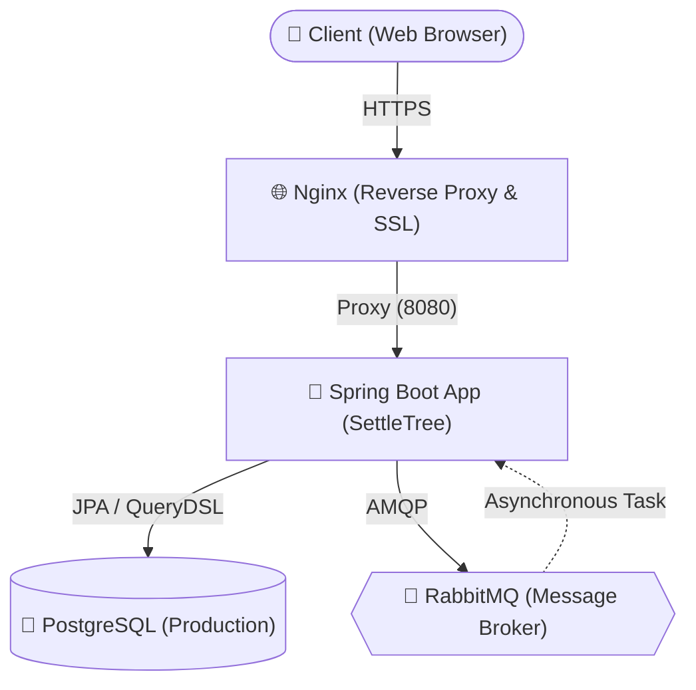
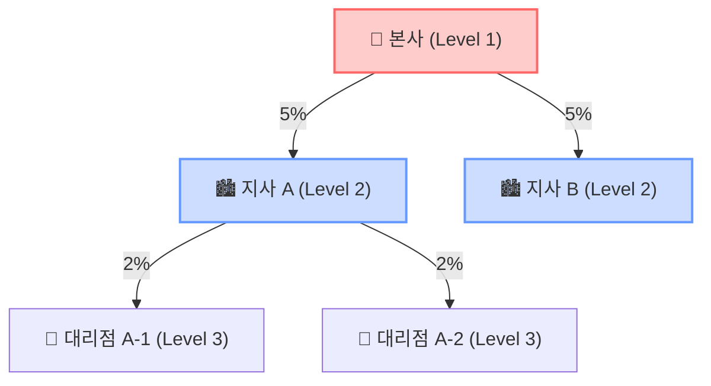

# SettleTree - 계층형 다단계 정산 및 승인 시스템


## 💡 프로젝트 개요

SettleTree는 본사, 지사, 대리점으로 이어지는 **계층형 조직 구조(Hierarchical Organization)**를 기반으로 정산 요청을 처리하고 승인 워크플로우를 전산화한 웹 애플리케이션입니다. 

다중 레벨로 구성된 조직에서는 하위 조직의 정산 요청이 상위 조직의 순차적인 검토를 거쳐야 하는 경우가 많습니다. 본 프로젝트는 이러한 비즈니스 요구사항을 분석하여, 각 계층의 역할을 분리하고 수수료가 상위로 분배되는 로직을 전산화하는 데 초점을 맞추었습니다.

### 주요 목적
* **승인 워크플로우의 시스템화**: 조직 레벨(Depth)에 따른 순차적 결재 프로세스 강제
* **정산 분배의 자동화**: 정해진 요율에 따라 발생한 수익을 각 조직 계층에 자동 분할 계산
* **수치 정합성 유지**: 시스템적 오차(소수점 등)로 인한 정산 유실을 방지하는 계산 체계 구현

---

## 🏗 아키텍처 및 구현 특징

### 시스템 흐름도 (System Architecture)


### 1. 계층형 조직의 조회 및 성능 최적화
* **Self-Referencing 구조**: 하나의 `Organization` 및 `SettlementNode` 테이블이 부모-자식 관계를 맺는 트리 형태로 설계되었습니다.
* **N+1 문제 방지 (QueryDSL Fetch Join)**: 깊이가 있는 트리를 순회할 때 JPA의 지연 로딩(Lazy Loading)으로 인해 쿼리가 기하급수적으로 발생하는 문제를 방지하고자, QueryDSL을 통한 `fetchJoin`을 적용해 계층 정보를 효율적으로 로드합니다.

### 2. 수수료 분배 체계 및 정합성 (낙전 보정 알고리즘)

**조직 계층 구조도 (Organization Hierarchy)**


정산에서 가장 중요한 부분은 "원금과 분배금의 합이 정확히 일치해야 한다"는 점입니다. 수수료를 % 단위로 하위 조직으로 분배하다 보면, 소수점 이하의 금액에서 오차(Dust, 낙전)가 발생합니다.

* **DFS (깊이 우선 탐색)**: 본사에서 대리점 끝단의 노드까지 트리를 탐색하며 수수료율에 따른 금액을 분할합니다.
* **절삭 로직 (`RoundingMode.DOWN`)**: 모든 노드에서는 분배금을 무조건 소수점 아래에서 내림(절삭) 처리합니다.
* **본사 보정**: 탐색 후 남은 1원 단위의 잔액은 트리의 가장 최상단(본사)에 강제 귀속하여 전체 수치 정합성(100%)을 맞춥니다.

### 3. Role/조직 레벨별 접근 제어 (Security)
Spring Security의 URL 차단과 `@PreAuthorize` 어노테이션을 결합하여 권한 검증을 처리합니다.
* **USER, ADMIN, SUPER_ADMIN**: 세 단계의 권한 모델을 사용합니다.
* 일반 사용자는 본인의 건만 볼 수 있고, 중간 관리자(지사/대리점 ADMIN)는 자신보다 하위 조직의 데이터만 승인하고 열람할 수 있도록 격리하였습니다.

### 4. 클라우드 인프라 운용 문제 해결 (OCI Free Tier)
비용 효율적인 배포를 위해 Oracle Cloud Infrastructure (OCI)의 무료 티어(1/8 OCPU, 1GB RAM)에 시스템을 구축하는 과정에서 발생한 메모리 한계(OOM)를 다음과 같이 해결했습니다. 

1. **Swap Memory 할당**: 1GB의 제한된 물리 메모리를 우회하기 위해 2GB의 Swap 파일을 `/etc/fstab`에 마운트하여 Spring Boot, DB, Nginx, RabbitMQ의 동시 구동을 보장했습니다.
2. **도커 빌드 최적화**: OCI 상의 CI/CD 과정에서 Gradle 빌드 시 불필요한 `-plain.jar`가 남는 현상을 방지하기 위해 `jar { enabled = false }` 처리를 진행했습니다.
3. **Nginx 기반 HTTPS 프록시**: Certbot을 연동하여 HTTPS 암호화를 구현하고 80포트를 443으로 리다이렉트하는 표준적인 웹 인프라 환경을 구축했습니다.

---

## 🛠 기술 스택

### Backend
- **Java 17** 
- **Spring Boot 3.3.2**
- **Spring Security 6.x** 
- **Spring Data JPA** 
- **QueryDSL 5.0** 
- **RabbitMQ** (비동기 메시징 지원)
- **MapStruct 1.5.5**

### Database
- **PostgreSQL** (Production 환경)
- **H2** (테스트 및 로컬 메모리 DB)

### Frontend
- **Thymeleaf + Bootstrap 5** (HTML 서버 사이드 렌더링)
- **SUIT 폰트 / 다크모드 대응** 등 일반적인 CSS, JS 기반 UI 구현

### Infrastructure & CI/CD
- **Oracle Cloud Infrastructure (OCI)** 
- **Docker / Docker Compose**
- **Nginx (SSL/HTTPS)**
- **GitHub Actions** 

---

## 🚀 로컬 환경 실행 가이드

```bash
# 1. RabbitMQ 백그라운드 실행 (도커 필요)
docker run -d --name rabbitmq -p 5672:5672 -p 15672:15672 rabbitmq:management

# 2. 로컬 프로파일(H2, Local RabbitMQ 의존) 지정하여 앱 실행
./gradlew clean build -x test
./gradlew bootRun --args='--spring.profiles.active=local'
```

- **웹 애플리케이션 접속**: http://localhost:8080/
- **H2 DB 접속 경로**: http://localhost:8080/h2-console
  - JDBC URL: `jdbc:h2:mem:testdb`
  - Username: `sa` (비밀번호 없음)
- **RabbitMQ 관리 도구**: http://localhost:15672 (아이디/비번: guest/guest)

---

## 📝 관리자 참고용 기초 세팅 (application.yml)
로컬 프로파일 모드로 부팅 시, 더미 데이터 구성을 위해 아래 계정이 자동 생성됩니다. (비밀번호는 `application.yml` 혹은 `.env`를 통해 주입 가능)

- **최고 관리자**: `admin@sattletree.com`
- **본사 관리자**: `hq_admin@sattletree.com`
- **서울지사 관리자**: `seoul_admin@sattletree.com`
- **강남대리점 관리자**: `gangnam_admin@sattletree.com`
- **강남대리점 일반사용자**: `gangnam_user@example.com`

---

## 👤 연락처 및 포트폴리오
* **개발자**: 김가율 (gayul.kim)
* **이메일**: gayulz@kakao.com
* **GitHub**: https://github.com/gayulz/multi-level-fee
* **운영 서버 환경**: https://settletree.p-e.kr/
